# awesome-CXL

## Contents

- [Quick Intro](#quick-intro)
- [Webinars and tutorials](#webinars-and-tutorials)
- [Papers and news](#papers-and-news)

## Quick Intro

- 3 min video about CXL: [Introduction to Compute Express Link™ (CXL™) Technology](https://youtu.be/HPpQLGIxZWM)

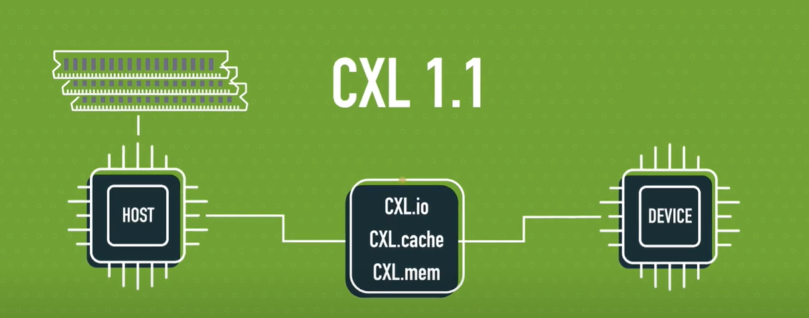

- 2 min video about CXL 2.0: [CXL™ 2.0 Overview](https://youtu.be/XP1sn9JkTg8)

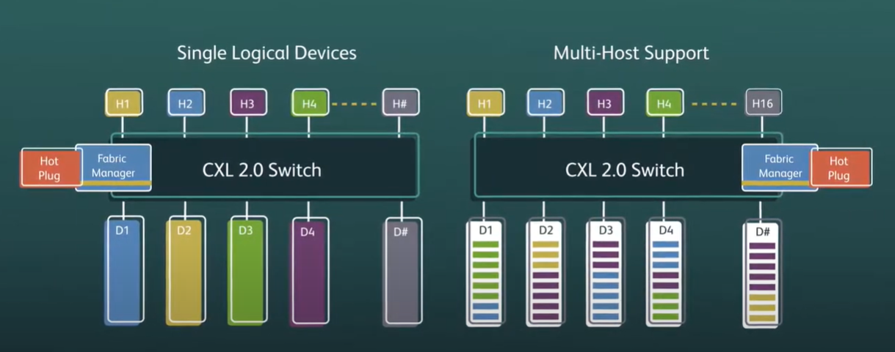

- 3 min video about CXL 3.0: [Introducing Compute Express Link™ (CXL™) 3.0](https://youtu.be/_HWWh7cBMq4)

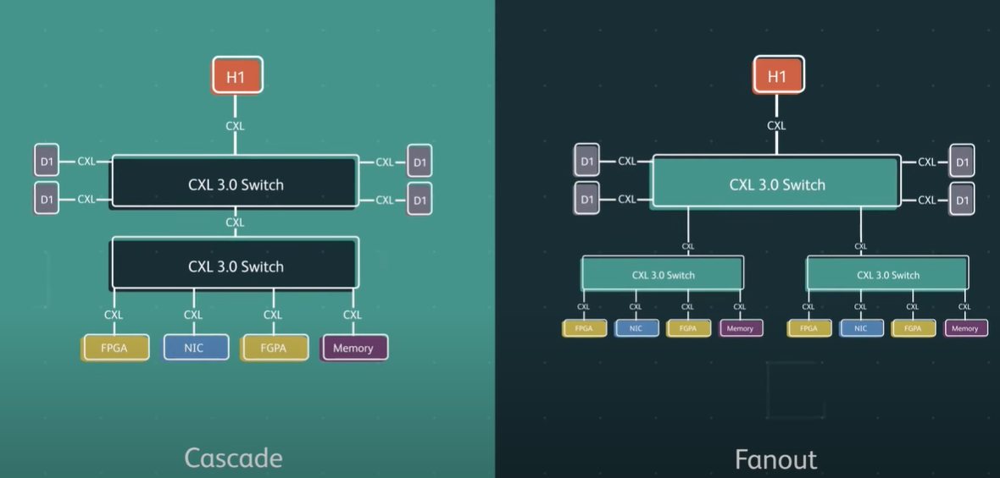

- 3 min video about CXL Cache Coherency: [Exploring Compute Express Link™ (CXL™) Cache Coherency](https://youtu.be/Z75iJqGK574)

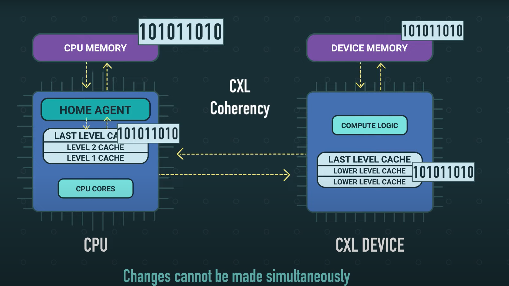

## Webinars and tutorials

### CXL insights from the industry

- [Micron](https://www.micron.com/solutions/server/cxl)
- [MemVerge](https://memverge.com/cxl-industry-news/)
- [Intel](https://www.intel.com/content/www/us/en/products/docs/memory-storage/optane-persistent-memory-to-cxl-attached-memory.html?wapkw=CXL)

### 3 Jan 2023, **SDC 2022**

- **Contents**:
  - Architecture and variety of memory services that will be available to developers with the advent of CXL
  - The different ways that developers will be able to access the memory services
  - Examples of memory service APIs and how to use them
- **Presented By**: Charles Fan, MemVerge
- **Recording**: [SDC2022 – Memory Disaggregation and Pooling with CXL](https://youtu.be/guefZgKQPM8)

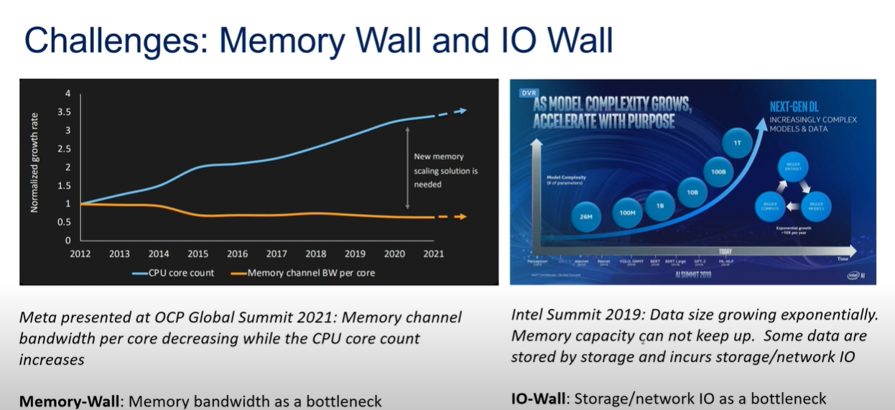

### 3 Dec 2022, **HotChips 34**

- **Contents**:
  - CXL overview and evolution
  - CXL2/CXL3 coherency deep dive
  - Memory use cases and challenges
  - CXL3 Fabric introduction & use cases
- **Presented By**: Ishwar Agarwal, Robert Blankenship(Intel); Prakash Chauhan, Meta, Mahesh Wagh, Tony Brewer, Micron, and Nathan Kalyanasundharam(AMD)
- **Recording**: [HC34-T1: CXL](https://youtu.be/pHuHUeSmGGk)
- **Slides**: [Hot Chips 34](https://hc34.hotchips.org/)

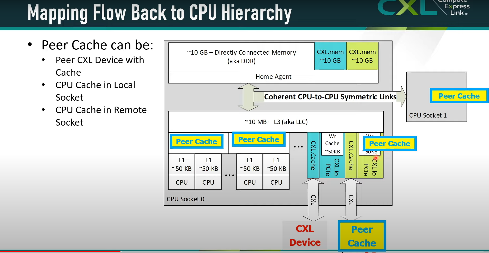

## Papers and news

### July 10, **OSDI 2024**

- **Paper**: [Managing Memory Tiers with CXL in Virtualized Environments](https://pages.cs.wisc.edu/~markhill/papers/osdi2024_cxl.pdf)
- **Authors**: Yuhong Zhong, Columbia University, Microsoft Azure; Daniel S. Berger, Microsoft Azure, University of Washington; Carl Waldspurger, Carl Waldspurger Consulting; Ryan Wee, Columbia University; Ishwar Agarwal, Rajat Agarwal, Frank Hady, and Karthik Kumar, Intel; Mark D. Hill, University of Wisconsin–Madison; Mosharaf Chowdhury, University of Michigan; Asaf Cidon, Columbia University

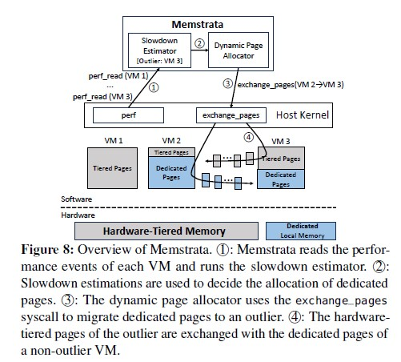

### April 27, 2024, **ASPLOS 2024**

- **Paper**: [TAROT: A CXL SmartNIC-Based Defense Against Multi-bit Errors by Row-Hammer Attacks](https://dl.acm.org/doi/pdf/10.1145/3620666.3651325)
- **Authors**: Song, Chihun and Kim, Michael Jaemin and Wang, Tianchen and Ji, Houxiang and Huang, Jinghan and Jeong, Ipoom and Park, Jaehyun and Nam, Hwayong and Wi, Minbok and Ahn, Jung Ho and Kim, Nam Sung

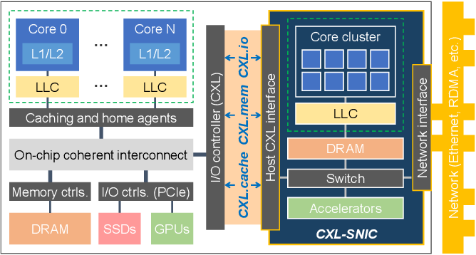

### April 22, 2024, **EuroSys 2024**

- **Paper**: [Exploring Performance and Cost Optimization with ASIC-Based CXL Memory](https://dl.acm.org/doi/pdf/10.1145/3627703.3650061)
- **Authors**: Tang, Yupeng and Zhou, Ping and Zhang, Wenhui and Hu, Henry and Yang, Qirui and Xiang, Hao and Liu, Tongping and Shan, Jiaxin and Huang, Ruoyun and Zhao, Cheng and Chen, Cheng and Zhang, Hui and Liu, Fei and Zhang, Shuai and Ding, Xiaoning and Chen, Jianjun.

### March 2, **HPCA 2024**

- **Paper**: [Salus: Efficient Security Support for CXL-Expanded GPU Memory](https://ieeexplore.ieee.org/document/10476444)
- **Authors**: Abdullah, Rahaf and Lee, Hyokeun and Zhou, Huiyang and Awad, Amro

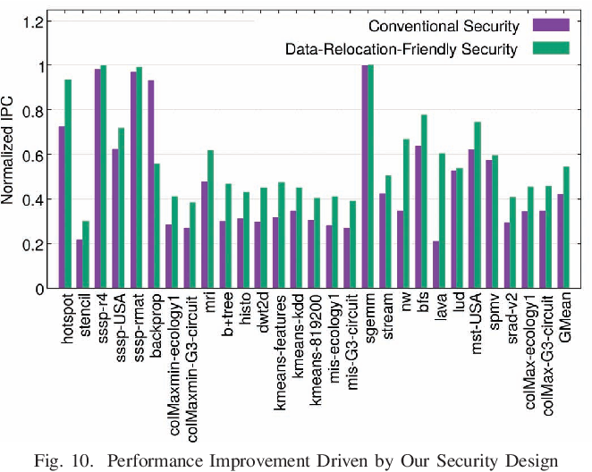

### March 2, **HPCA 2024**

- **Paper**: [Computational CXL-Memory Solution for Accelerating Memory-Intensive Applications](https://ieeexplore.ieee.org/document/9969883)
- **Authors**: Sim, Joonseop and Ahn, Soohong and Ahn, Taeyoung and Lee, Seungyong and Rhee, Myunghyun and Kim, Jooyoung and Shin, Kwangsik and Moon, Donguk and Kim, Euiseok and Park, Kyoung

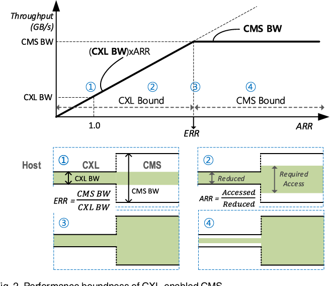

### March 2, **HPCA 2024**

- **Paper**: [An LPDDR-based CXL-PNM Platform for TCO-Efficient GPT Inference](https://ieeexplore.ieee.org/document/10476443)
- **Authors**: Park, Sang-Soo and Kim, KyungSoo and So, Jinin and Jung, Jin and Lee, Jonggeon and Woo, Kyoungwan and Kim, Nayeon and Lee, Younghyun and Kim, Hyungyo and Kwon, Yongsuk and Kim, Jinhyun and Lee, Jieun and Cho, YeonGon and Tai, Yongmin and Cho, Jeonghyeon and Song, Hoyoung and Ahn, Jung Ho and Kim, Nam Sung

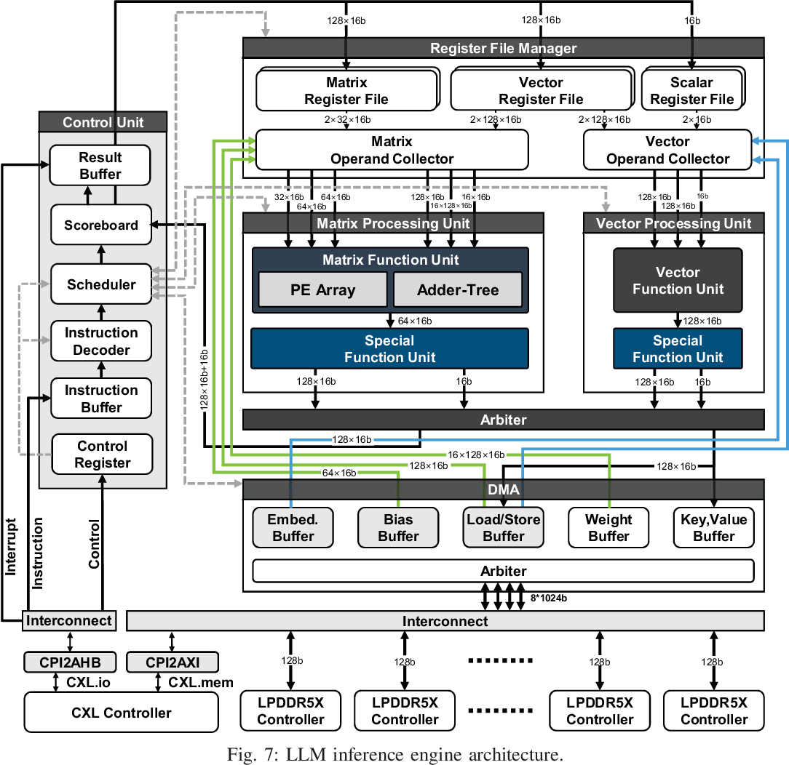

### 8 - 10 August, 2023

- **Event**: [Flash Memory Summit](https://flashmemorysummit.com/)
- **Presentations**:
  - [Compute Express Link (CXL) 3.0: Enhancements to memory pooling and sharing​](https://www.flashmemorysummit.com/English/Conference/Program_at_a_Glance_Tue.html#SARC-101-1)
  - [Compute Express Link (CXL) Device Ecosystem and Usage Models – Panel Session](https://www.flashmemorysummit.com/English/Conference/Program_at_a_Glance_Thu.html#SARC-304-2)
  - [Top 3 Challenges and Solutions for Delivering the Full Premise of CXL](https://www.flashmemorysummit.com/English/Conference/Keynotes_2023.html)

### July 11, 2023, **ATC 2023**

- **Paper**: [CXL-ANNS: Software-Hardware Collaborative Memory Disaggregation and Computation for Billion-Scale Approximate Nearest Neighbor Search](https://www.usenix.org/system/files/atc23-jang.pdf)
- **Authors**: Junhyeok Jang, Computer Architecture and Memory Systems Laboratory, KAIST; Hanjin Choi, Computer Architecture and Memory Systems Laboratory, KAIST and Panmnesia, Inc.; Hanyeoreum Bae and Seungjun Lee, Computer Architecture and Memory Systems Laboratory, KAIST; Miryeong Kwon and Myoungsoo Jung, Computer Architecture and Memory Systems Laboratory, KAIST and Panmnesia, Inc.

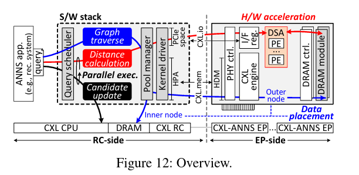

### July 11, 2023, **ATC 2023**

- **Paper**: [Overcoming the Memory Wall with CXL-Enabled SSDs](https://www.usenix.org/system/files/atc23-yang-shao-peng.pdf)
- **Authors**: Shao-Peng Yang, Syracuse University; Minjae Kim, DGIST; Sanghyun Nam, Soongsil University; Juhyung Park, DGIST; Jin-yong Choi and Eyee Hyun Nam, FADU Inc.; Eunji Lee, Soongsil University; Sungjin Lee, DGIST; Bryan S. Kim, Syracuse University

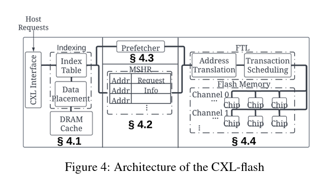

### 12 May 2023, **DRAM supporting CXL 2.0**

Samsung Develops Industry’s First CXL DRAM Supporting CXL 2.0! See more details [here](https://news.samsung.com/global/samsung-develops-industrys-first-cxl-dram-supporting-cxl-2-0)

> Building on its development of the industry’s first CXL 1.1-based CXL DRAM in May of 2022, Samsung’s introduction of the 128GB CXL DRAM based on CXL 2.0 is expected to accelerate commercialization of next-generation memory solutions. The new CXL DRAM supports PCle 5.0 interface (x8 lanes) and provides bandwidth of up to 35GB per second.

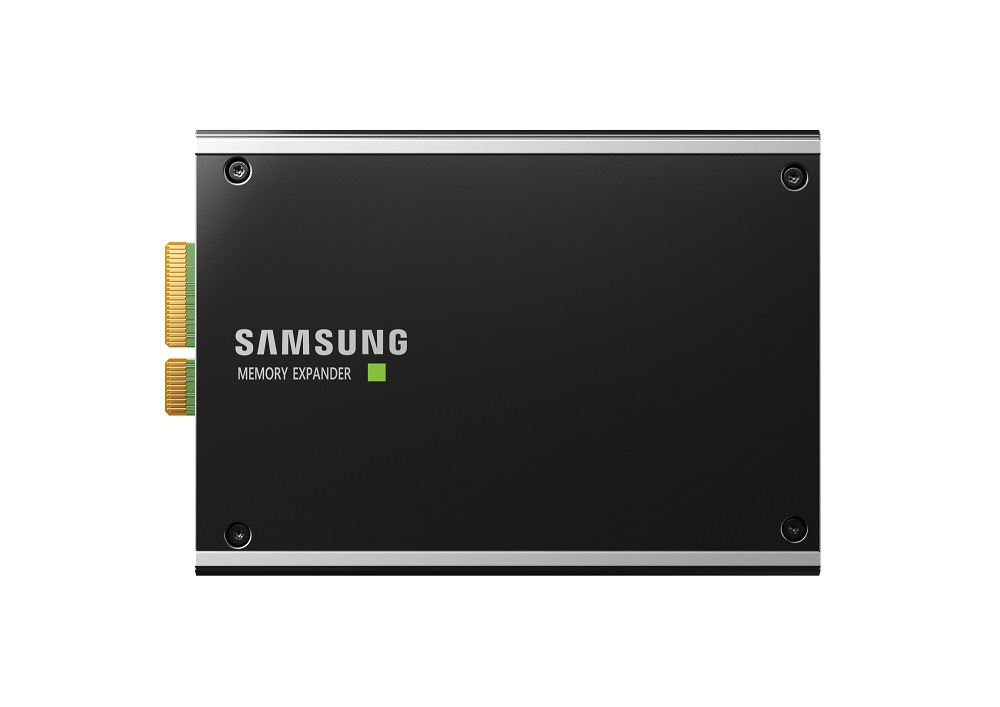
### 27 March 2023, **CXL 1.1**

- **Paper**: [Demystifying CXL Memory with Genuine CXL-Ready Systems and Devices](https://arxiv.org/pdf/2303.15375)
- **Authors**: Yan Sun and Yifan Yuan and Zeduo Yu and Reese Kuper and Ipoom Jeong and Ren Wang and Nam Sung Kim

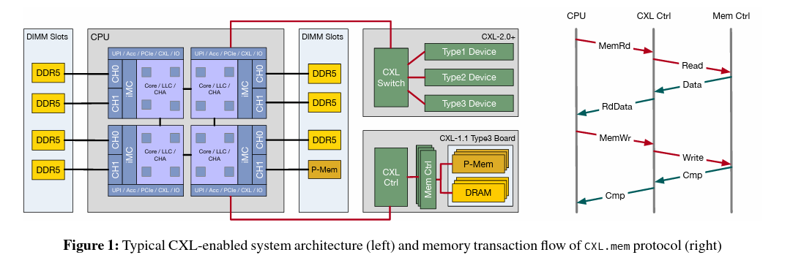

### 10 Mar 2023, **Software Simulated CXL**

- **Paper**: [CXLMemSim: A pure software simulated CXL.mem for performance characterization](https://arxiv.org/pdf/2303.06153)
- **Authors**: Yiwei Yang and Pooneh Safayenikoo and Jiacheng Ma and Tanvir Ahmed Khan and Andrew Quinn
- **Presentation**: [CXLMemSim: A pure software simulated CXL.mem for performance characterization #92](https://youtu.be/1iFd8zbRblc)
- **source code**: [CXL.mem Simulator](https://github.com/SlugLab/CXLMemSim)

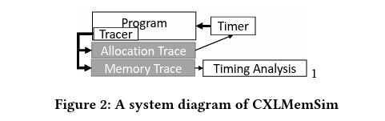

### 30 January 2023, **ASPLOS 2023**

- **Paper**: [Pond: CXL-Based Memory Pooling Systems for Cloud Platforms](https://doi.org/10.1145/3575693.3578835)
- **Authors**: Li, Huaicheng and Berger, Daniel S. and Hsu, Lisa and Ernst, Daniel and Zardoshti, Pantea and Novakovic, Stanko and Shah, Monish and Rajadnya, Samir and Lee, Scott and Agarwal, Ishwar and Hill, Mark D. and Fontoura, Marcus and Bianchini, Ricardo
- **Presentation**: [ASPLOS'23 - Session 9A - Pond: CXL-Based Memory Pooling Systems for Cloud Platforms](https://www.youtube.com/watch?v=dJnvw5KJCCY)
- **source code**: [Pond - Compute Express Link (CXL) based Memory Pooling Systems](https://github.com/vtess/Pond)

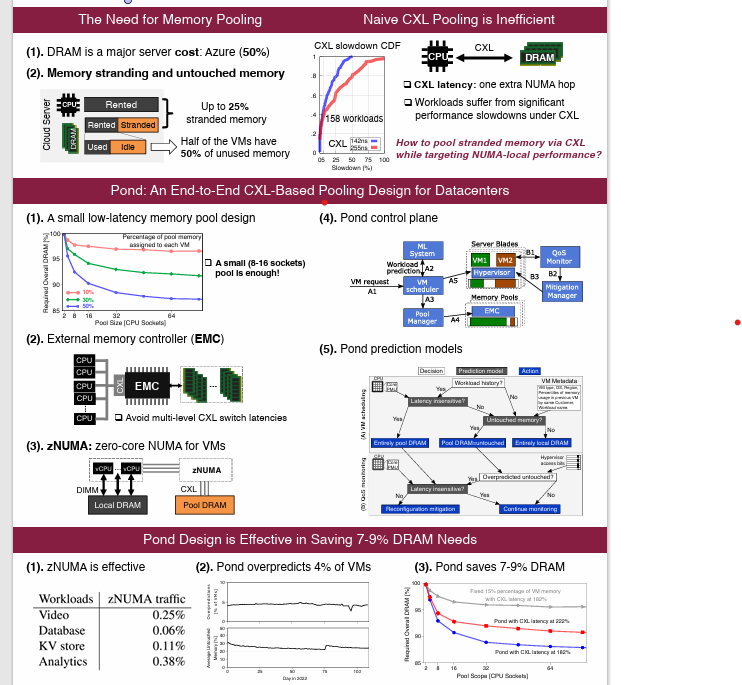

### 25 March 2023, **ASPLOS 2023**

- **Paper**: [TPP: Transparent Page Placement for CXL-Enabled Tiered-Memory](https://arxiv.org/pdf/2206.02878)
- **Authors**: Maruf, Hasan Al and Wang, Hao and Dhanotia, Abhishek and Weiner, Johannes and Agarwal, Niket and Bhattacharya, Pallab and Petersen, Chris and Chowdhury, Mosharaf and Kanaujia, Shobhit and Chauhan, Prakash
- **Presentation**: [ASPLOS'23 - Session 9A - TPP: Transparent Page Placement for CXL-Enabled Tiered Memory](https://www.youtube.com/watch?v=dynwKQ01-ho)
- **source code**: [[PATCH 5/5] Transparent Page Placement for Tiered-Memory](https://lwn.net/ml/linux-kernel/cover.1637778851.git.hasanalmaruf@fb.com/)

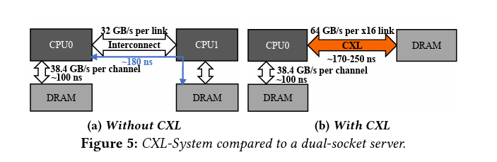

### 21 October 2022, **USENIX ATC 2022**, **CXL 2.0 based on FPGA**

- **Paper**: [Direct Access, High-Performance Memory Disaggregation with DirectCXL](https://www.usenix.org/system/files/atc22-gouk.pdf)
- **Authors**: Donghyun Gouk and Sangwon Lee and Miryeong Kwon and Myoungsoo Jung
- **Presentation**: [USENIX ATC '22 - Direct Access, High-Performance Memory Disaggregation with DirectCXL
](https://www.youtube.com/watch?v=I7wF-TCHGEI)

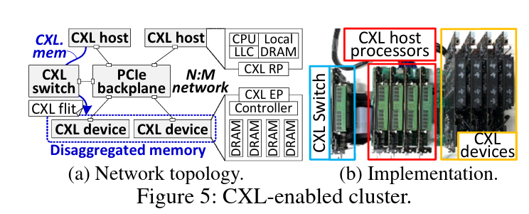

### 27 June 2022, **HotStorage 2022**

- **Paper**: [Hello bytes, bye blocks: PCIe storage meets compute express link for memory expansion (CXL-SSD)](https://www.hotstorage.org/2022/camera-ready/hotstorage22-31/pdf/hotstorage22-31.pdf)
- **Authors**: Jung, Myoungsoo
- **Presentation**: [CAMEL | CXL-SSD: Expanding PCIe Storage as Working Memory over CXL](https://www.youtube.com/watch?v=m4L3_WvBTnA)

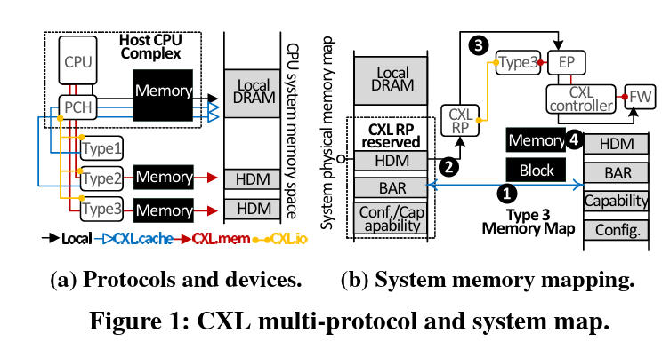
